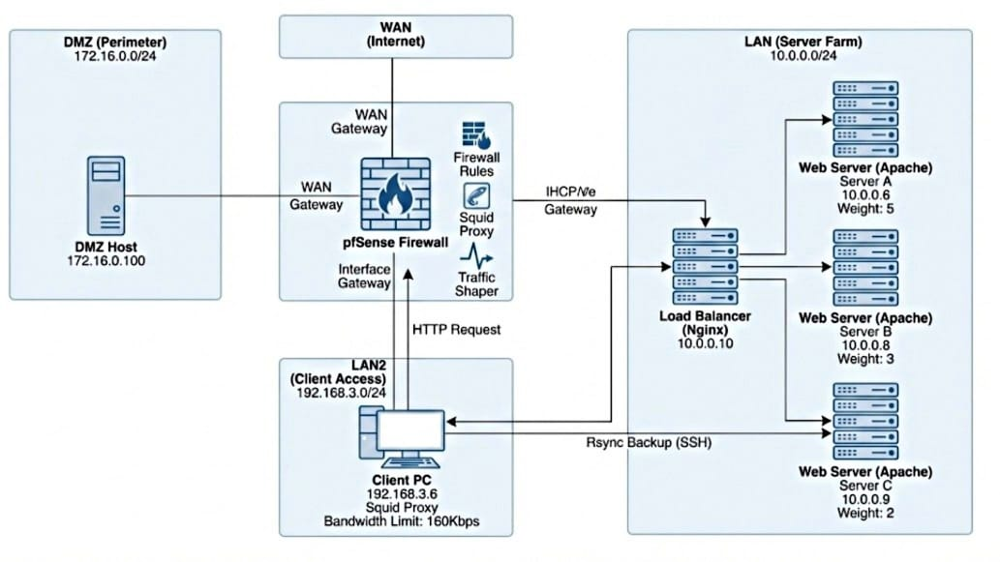

# Secure Enterprise Network Architecture & Automation


## 📌 Project Overview
This project demonstrates the design and implementation of a secure, segmented enterprise network infrastructure using **pfSense** and **CentOS/Enterprise Linux**. The primary focus was to simulate a real-world environment requiring strict traffic filtering, proxy management, high-availability web services, and automated disaster recovery.

**Key Competencies Demonstrated:**
* **Network Security:** Deep packet inspection, firewall rule creation, and DMZ segmentation.
* **Traffic Control:** Transparent proxying (Squid), content filtering (SquidGuard), and bandwidth shaping.
* **High Availability:** Weighted Round-Robin Load Balancing using Nginx.
* **Automation:** Bash scripting for incremental backups with rotation logic.

---

## 🏗️ System Architecture

The architecture consists of **7 Virtual Machines** operating across **4 distinct network zones** (WAN, LAN, LAN2, DMZ) to simulate a segmented, secure enterprise infrastructure.

| Node Role | OS | IP Address | Service Function |
| :--- | :--- | :--- | :--- |
| **Perimeter Firewall** | pfSense (FreeBSD) | `10.0.0.254` (LAN)<br>`192.168.3.254` (LAN2)<br>`172.16.0.1` (DMZ) | NAT Gateway, DPI Firewall, Squid Proxy, Traffic Shaping, VLAN Routing |
| **Load Balancer** | CentOS Stream 9 | `10.0.0.10` | Nginx Reverse Proxy, Weighted Round-Robin Distribution |
| **Web Server A** | CentOS Stream 9 | `10.0.0.6` | Apache HTTPD, High-Capacity Backend (Weight: 5) |
| **Web Server B** | CentOS Stream 9 | `10.0.0.8` | Apache HTTPD, Med-Capacity Backend (Weight: 3) |
| **Web Server C** | CentOS Stream 9 | `10.0.0.9` | Apache HTTPD, Low-Capacity Backend (Weight: 2) |
| **Admin Client** | CentOS Stream 9 | `192.168.3.6` | Traffic Generation, Automated Rsync Backups, Cron Scheduling |
| **DMZ Host** | CentOS Stream 9 | `172.16.0.100` | Isolated Testing, SSH Target |

---

## 🗺️ Network Topology

The following diagram illustrates the logical traffic flow and segmentation enforced by the pfSense firewall.

<p align="center">
  <br>
  
</p>

---

## 🛡️ 1. Firewall & Perimeter Security (pfSense)

The security core of this infrastructure is built on **pfSense Community Edition**, operating as a stateful firewall and unified threat management (UTM) gateway. The system was architected to enforce strict network segmentation, application-layer filtering, and granular access control across four isolated zones.

## 1.1 Virtual Network Architecture (Layer 2 Segmentation)
To simulate a physical enterprise environment within VMware Workstation, four distinct **Host-Only** networks (VMnets) were created. This ensures complete isolation between zones, forcing all inter-VLAN traffic to pass through the pfSense firewall for inspection.

* **Custom VMnets:** Created specific virtual switches (VMnet11, VMnet12, VMnet13) with local DHCP disabled to prevent rogue addressing.
* **Adapter Binding:** The pfSense VM was configured with 5 network adapters to bridge these virtual switches.

* **Verification:**
   * **Evidence 1:** [📸 Virtual Network Editor Configuration](docs/1.png)
   * **Evidence 2:** [📸 VM Hardware Settings](docs/2.png)

## 1.2 Interface Configuration & Addressing
The firewall interfaces were assigned static IPv4 addresses to act as the default gateway for each subnet. The WAN interface utilizes NAT to provide upstream internet access to internal clients.

| Interface | Physical Port | Zone Name | Subnet | Role |
| :--- | :--- | :--- | :--- | :--- |
| **WAN** | `le0` | `WAN` | DHCP | Upstream Internet / NAT |
| **LAN** | `le1` | `LAN` | `10.0.0.0/24` | **Server Farm:** High-security zone for web servers. |
| **OPT1** | `le2` | `LAN2` | `192.168.3.0/24` | **Client Zone:** Restricted network for end-users. |
| **OPT2** | `le3` | `DMZ` | `172.16.0.0/24` | **Perimeter:** Isolated zone for exposed services. |

* **Verification:**
   * **Evidence 1:** [📸 pfSense Console Interface Assignment](docs/3.png)
   * **Evidence 2:** [📸 pfSense Dashboard Status](docs/4.png)

## 1.3 Stateful Firewall Rules (ACLs)
A **Zero Trust** policy was applied, creating specific "Allow" rules only for necessary business traffic. All other traffic is implicitly denied.

#### **A. LAN Zone (Server Farm)**
The Server Farm is protected from unauthorized access.
* **Egress:** Allowed outbound HTTP/HTTPS to the internet (for package updates).
* **Ingress Protection:** A specific block rule was implemented to deny traffic originating from the `LAN2` client subnet, preventing lateral movement attacks from compromised workstations.
* **Verification:**
   * **Evidence 1:** [📸 LAN Firewall Rules](docs/5.png)

#### **B. LAN2 Zone (Client Access)**
The Client network is highly restricted to prevent data exfiltration and limit attack surface.
* **Web Traffic:** HTTP (80), HTTPS (443), and FTP (21) are permitted to the WAN.
* **Administration:** SSH (Port 22) is strictly permitted *only* to the **DMZ** subnet for management tasks.
* **Isolation:** A strict rule blocks all traffic destined for the `LAN` subnet (Server Farm).
* **Verification:**
   * **Evidence 1:** [📸 LAN2 Firewall Rules](docs/6.png)

#### **C. DMZ Zone (Perimeter)**
The DMZ is designed as a semi-trusted buffer zone.
* **Outbound:** Unrestricted outbound access is permitted to simulate a public-facing network segment.
* **Inbound:** Accepts administrative SSH connections originating from the trusted `LAN2` network.
* **Verification:**
   * **Evidence 1:** [📸 DMZ Firewall Rules](docs/7.png)

## 1.4 Proxy & Content Filtering (Layer 7 Security)
To enforce Acceptable Use Policies (AUP) and monitor user behavior, a transparent proxy stack was deployed.

**Installed Packages:**
* **Squid:** Caching proxy server.
* **SquidGuard:** URL redirector and content filter.
* **LightSquid:** Log analyzer and reporting tool.
* **Verification:**
   * **Evidence 1:** [📸 Package Manager](docs/8.png)

## 1.5 **Web Filtering Configuration (SquidGuard)**
The proxy was configured to intercept HTTP traffic transparently. **SquidGuard** was utilized to define Access Control Lists (ACLs).
* **Policy:** `BadSites` category set to **Deny**.
* **Default Access:** Allowed.
* **Outcome:** Users attempting to access forbidden categories are blocked immediately.
* **Verification:**
   * **Evidence 1:** [📸 SquidGuard Common ACL Settings](docs/10.png)

## 1.6 **Traffic Analysis & Reporting (LightSquid)**
**LightSquid** was configured to parse Squid access logs and generate detailed daily reports. This provides visibility into:
* Top visited websites.
* Bandwidth usage per user/IP.
* Blocked access attempts.
* **Verification:**
   * **Evidence 1:** [📸 LightSquid User Access Report](docs/9.png)

## 1.7 Traffic Shaping (Bandwidth Management)
To prevent network congestion, Quality of Service (QoS) policies were implemented using pfSense **Limiters**.

* **Objective:** Restrict bandwidth usage for the `LAN2` Client network.
* **Configuration:**
    * **Download Limiter:** Capped at **160 Kbit/s**.
    * **Upload Limiter:** Capped at **160 Kbit/s**.
* **Implementation:** These limiters were attached to the LAN2 firewall pass rules via the `In/Out Pipe` advanced settings.
* **Verification:** Validated using `wget` to confirm download speeds stabilized at ~20KB/s (approx. 160Kbps).
   * **Evidence 1:** [📸 Traffic Shaper (Limiter) Configuration](docs/11.png)**

---

## ⚖️ 2. High Availability Load Balancing (Nginx)

To ensure service reliability and optimized resource utilization, a **Layer 7 Load Balancer** was deployed using **Nginx**. This component sits in the trusted LAN zone, acting as the single entry point for all internal web traffic, abstracting the complexity of the backend server farm from the client.

## 2.1 Backend Server Provisioning (Apache HTTPD)
Three distinct backend servers (Server A, Server B, Server C) were provisioned with **Apache Web Server**. To simulate a heterogeneous environment with varying hardware capabilities, custom index pages were deployed to visually identify which node processed the request during testing.

* **Server A:** High Capacity Node
* **Server B:** Medium Capacity Node
* **Server C:** Low Capacity Node
* **Verification:**
   * **Evidence 1:** [📸 Backend Server Status Verification](docs/12.png)

## 2.2 Weighted Round-Robin Algorithm
The Nginx load balancer was configured with a **Weighted Round-Robin** strategy. This algorithm was chosen to distribute traffic proportionally based on the compute capacity of each backend node, rather than a simple equal-distribution model.

**Configuration Logic (`nginx.conf`):**
An `upstream` block was defined with specific integer weights corresponding to the target traffic distribution ratios:

* **Server A (`10.0.0.6`):** **Weight = 5** (Handles ~50% of traffic)
* **Server B (`10.0.0.8`):** **Weight = 3** (Handles ~30% of traffic)
* **Server C (`10.0.0.9`):** **Weight = 2** (Handles ~20% of traffic)

The reverse proxy listens on Port 80, and forwards requests via `proxy_pass http://backend_servers;`.
* **Verification:**
   * **Evidence 1:** [📸 Nginx Upstream Configuration](docs/13.png)


## 2.3 Traffic Distribution Verification
To validate the load balancing logic, a stress test was executed from the **Client Machine** (LAN2 Zone). A bash loop was used to generate **10 sequential HTTP requests** to the Load Balancer's Virtual IP (`10.0.0.10`).

**Test Command:**
```bash
for i in {1..10}; do curl [http://10.0.0.10](http://10.0.0.10); echo; done
```

* **Verification:**
   * **Evidence 1:** [📸 Round-Robin Response Test](docs/14.png)
---

## 🔄 3. Automated Backup & Disaster Recovery (Bash & Cron)

To ensure business continuity and data resilience, a custom **Bash automation suite** was developed. This system performs daily, incremental backups of critical data from the `LAN` Server Farm (Server A) to a secure archive on the `LAN2` Admin Client, utilizing **SSH keys** for secure, passwordless authentication.

### 3.1 Backup Logic & Scripting
A robust shell script (`backup_script.sh`) was engineered to handle the backup lifecycle. The script implements a "Rotation-First" strategy to preserve historical data versions before synchronizing new changes.

**Key Script Functions:**
1.  **Version Control (Rotation):** Before starting a new backup, the script detects if a `backup` directory already exists. It renames this existing folder with a precise timestamp (e.g., `backup_2026-01-07_21-36-42`), effectively creating a restore point.
2.  **Incremental Synchronization:** Uses `rsync` with the `-avz` flags (Archive mode, Verbose, Compression) to securely transfer data from `Server A:/data/` to the local machine.
3.  **Retention Policy:** A `find` command automatically scans for backup directories older than **7 days** and purges them to optimize storage usage.
4.  **Error Handling:** Includes exit codes (`$?`) to verify the success of the transfer and log the outcome.
* **Verification:**
   * **Evidence 1:** [📸 Backup Script Source Code](docs/15.png)


### 3.2 Job Scheduling (Cron)
To eliminate manual intervention, the backup process was automated using the **Cron** daemon. The job is scheduled to execute daily during off-peak hours to minimize network impact.

**Schedule Configuration:**
* **Time:** `16:30` (4:30 PM) daily.
* **Command:** `/root/backup_script.sh`
* **Logging:** `Standard Output` and `Standard Error` are redirected to `/var/log/backup.log` for audit trails (`>> /var/log/backup.log 2>&1`).
* **Verification:**
   * **Evidence 1:** [📸 Crontab Schedule](docs/16.png)


### 3.3 Execution Verification
The disaster recovery workflow was validated by manually triggering the script and inspecting the filesystem structure.

**Validation Results:**
* **Successful Transfer:** Critical files (`file1.txt`, `file2.txt`, `important.doc`) were successfully replicated from Server A.
* **Directory Rotation:** The filesystem shows distinct directories for the current backup (`backup`) and the previous archive (`backup_2026-01-07...`), confirming the rotation logic is active.
* **Verification:**
   * **Evidence 1:** [📸 Backup Verification & Directory Structure](docs/17.png)

---

## 📂 Configuration & Codebase Navigation

This repository is organized by service role. Click the file names below to view the sanitized configuration code used in this project.

### 1. Infrastructure Services (Load Balancing & Backup)

| Component | File Name | Description |
| :--- | :--- | :--- |
| **Load Balancer** | [**nginx.conf**](configs/nginx_loadbalancer.conf) | Nginx configuration defining the `upstream` block and Weighted Round-Robin logic (50/30/20 split). |
| **Automation** | [**automated_backup.sh**](scripts/automated_backup.sh) | Bash script executing incremental `rsync` transfers with directory rotation and 7-day retention policy. |

---

## 📂 Repository Structure

```
Secure-Enterprise-Network-Architecture/
│
├── README.md                  # The main documentation file (Copy content below)
│
├── scripts/                   # Folder for your automation scripts
│   └── automated_backup.sh    
│
├── configs/                   # Folder for configuration files
│   └── nginx_loadbalancer.conf  
│
├── docs/                      # Folder for all your evidence screenshots
│   ├── 01_vmware_network.png
│   ├── 02_pfsense_interfaces.png
│   ├── 03_firewall_rules_lan2.png
│   ├── 04_squid_proxy_report.png
│   ├── 05_bandwidth_limiter.png
│   ├── 06_nginx_wrr_test.png
│   └── ...
│  
│
└── diagrams/                  # Folder for topology diagrams
    └── network_topology.png   
```
